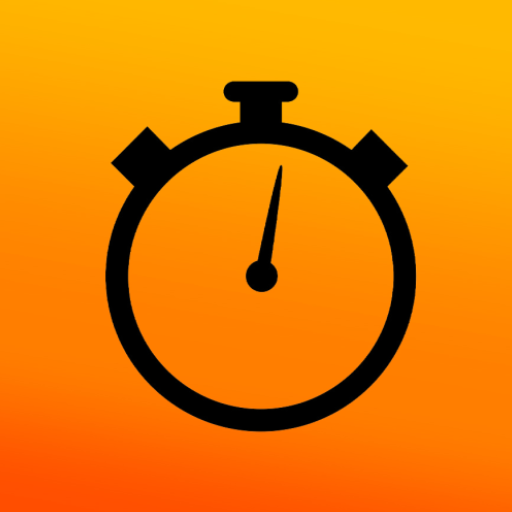

  
  <h1>My Schedule</h1>
  

    <b>Умный планировщик для сложных учебных графиков.</b> 
    Android • Wear OS • Widgets
  

  
  

---

## О проекте

**My Schedule** решает проблему нестандартных расписаний, с которой не справляются обычные календари. 
Приложение спроектировано так, чтобы быть максимально быстрым: запуск за доли секунды, работа без интернета и мгновенный доступ к информации через виджеты и смарт-часы.

### Основные возможности

| Гибкость | Экосистема | Удобство |
| :--- | :--- | :--- |
| Поддержка **различного количества недель** с авто-переключением. | Полноценная версия для **Wear OS** с поддержкой Tiles. | **Виджеты** на рабочий стол с актуальным статусом. |
| Режим **"Семестр"** для уникального расписания на каждую неделю. | Синхронизация данных между телефоном и часами без облака. | **Импорт/Экспорт** расписания файлом (JSON). |

---

## Обзор интерфейса

<table>
  <tr>
    <th width="33%">Главный экран</th>
    <th width="33%">Управление неделями</th>
    <th width="33%">Редактирование</th>
  </tr>
  <tr>
    <td></td>
    <td></td>
    <td></td>
  </tr>
  <tr>
    <td align="center"><i>Визуальный таймер и статус</i></td>
    <td align="center"><i>Поддержка 20+ недель</i></td>
    <td align="center"><i>Цветовые метки и заметки</i></td>
  </tr>
</table>

### 🌗 Адаптивный дизайн (Dark & Light)

Приложение автоматически подстраивается под системную тему, сохраняя читаемость и фирменный стиль.

<table>
  <tr>
    <th width="33%">Главная (Light)</th>
    <th width="33%">Список (Light)</th>
    <th width="33%">Настройки (Light)</th>
  </tr>
  <tr>
    <td></td>
    <td></td>
    <td></td>
  </tr>
</table>

### Wear OS

Приложение адаптировано для экосистемы Android. Вы можете узнать аудиторию, просто взглянув на часы или рабочий стол.

<table>
  <tr>
    <td width="50%" align="center">
      
       <b>Приложение Wear OS</b>
    </td>
    <td width="50%" align="center">
      
       <b>Плитка Wear OS с таймером</b>
    </td>
  </tr>
</table>

---

## Техническая реализация

Проект построен на современном стеке Android разработки, с упором на чистую архитектуру и производительность.

*   **UI:** Jetpack Compose, Material Design 3.
*   **Wear OS:** Wear Compose, Horologist, ProtoLayout (Tiles).
*   **Architecture:** Single Activity, MVVM, Unidirectional Data Flow.
*   **Data Layer:** Kotlin Serialization (JSON), FileProvider для шаринга.
*   **Integration:** Jetpack Glance (AppWidgets), Wearable Data Layer API.

---

## Установка

1.  Перейдите в раздел [Releases](https://github.com/l-Mel-l/MySchedule/releases/tag/v1.2).
2.  Скачайте файл `MySchedule_Phone_v1.1` для смартфона.
3.  *(Опционально)* Скачайте `MySchedule_Watch_v1.1` для установки на часы через ADB или Bugjaeger.

---

  
  Разработано с вниманием к деталям. 2026.

*Created for fun by [Mel](https://github.com/l-Mel-l)*
